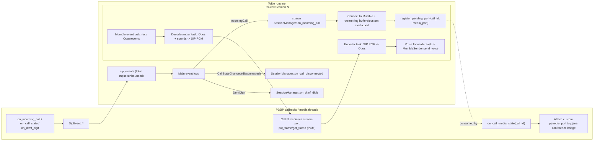
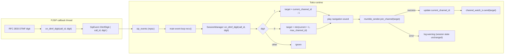

# mumble-sip

A SIP-to-Mumble audio bridge. Receives inbound SIP calls and routes audio bidirectionally into Mumble servers. Each call gets its own independent Mumble connection, and calls can be routed to different Mumble servers using a custom `X-Mumble-Server` SIP header. 

This has been a project I've wanted to do for a while. After joining a startup I wanted to really stress test the current generation of models (Opus 4.6) and see what they could really do. Most of this codebase was "*vibe coded*" I provided high level design, for example I knew that I wanted to bind pjsip into this library since it's fast and battle tested. I reviewed the code to make sure the AI was sane and to see what the current SOTA could do, which was very fucking good. I trust this library to run stablely and securely.

## Features

- Multiple simultaneous SIP calls, each with its own Mumble bot user
- Per-call Mumble server routing via `X-Mumble-Server` SIP header
- Opus audio encoding/decoding at 48kHz
- Lock-free audio pipeline between PJSIP and Mumble
- Configurable max concurrent calls
- DTMF Navigation
  - `*` for previous channel
  - `#` for next channel
  - `1` to replay the intro message
- Automatic intro playback for first-time callers or callers returning after a configurable absence (default 30 days) — plays before connecting to Mumble so it's heard clearly
- Optional Pocket-TTS channel-name announcements via HTTP service
- Persistent caller settings via SQLite — callers get auto-generated nicknames instead of exposing phone numbers

## Dependencies

**System packages:**
- binutils, make, gcc (for building PJSIP)
- [protoc](https://protobuf.dev/installation/) (for Mumble protocol buffers)
- ALSA development libraries (`libasound2-dev` on Debian/Ubuntu)
- OpenSSL development libraries (`libssl-dev`)
- Opus development library (`libopus-dev`)
- UUID library (`uuid-dev`)
- Rust / cargo

## Building

```bash
git clone --recursive https://github.com/youruser/mumble-sip.git
cd mumble-sip

# If you already cloned without --recursive:
git submodule update --init --recursive

cargo build --release
```

## Configuration

Copy `config.toml.example` to `config.toml` and edit it:

```toml
[sip]
listen_port = 5060
account_uri = "sip:bridge@pbx.example.com"
registrar = "sip:pbx.example.com"
username = "bridge"
password = "secret"
max_concurrent_calls = 10

[mumble]
default_host = "mumble.example.com"
port = 64738
password = ""
channel = "SIP Calls"
accept_invalid_cert = true

[audio]
sample_rate = 48000
frame_duration_ms = 10
opus_bitrate = 32000
jitter_buffer_ms = 60
intro_replay_after_days = 30

[tts]
enabled = false
host = "127.0.0.1"
port = 8000
voice = "eponine"
announce_on_connect = true
startup_timeout_ms = 20000
request_timeout_ms = 3000
announcement_debounce_ms = 750

[database]
path = "mumble-sip.db"
```

When running with Docker Compose, set `[tts].host = "pocket-tts"` so `mumble-sip` reaches the sibling container.
For persistence in Docker Compose, keep `[database].path = "mumble-sip.db"` (or set an explicit `/data/...` path); the compose service runs with `working_dir: /data` and mounts `mumble_sip_data` there.

### Caller Nicknames & Database

Callers are assigned Docker-style generated nicknames (e.g. "relaxed_babbage") that persist across calls. Phone numbers are never exposed as Mumble usernames. The nickname mapping is stored in a local SQLite database (default: `mumble-sip.db` in the working directory), created automatically on first run.

The `[database].path` setting controls where the database file is stored. No external database server is required.

## Usage

```bash
./target/release/mumble-sip config.toml
```

## Docker Compose

Docker assets live under `docker/`. Run `mumble-sip` and `pocket-tts` together:

```bash
docker compose -f docker/docker-compose.yml up -d --build
```

Before starting, make sure your `config.toml` has:

```toml
[tts]
enabled = true
host = "pocket-tts"
port = 8000
```

### Multi-arch image build (amd64 + arm64)

If you want to publish images for both `x86_64` and ARM clients:

```bash
docker buildx build --platform linux/amd64,linux/arm64 -f docker/Dockerfile -t yourorg/mumble-sip:latest --push .
docker buildx build --platform linux/amd64,linux/arm64 -f docker/Dockerfile.pocket-tts -t yourorg/pocket-tts:latest --push .
```

## Asterisk Integration

### PJSIP Endpoint

Define an endpoint in `pjsip.conf` (or the equivalent in your Asterisk config) for the mumble-sip bridge. There are two approaches depending on your network setup:

#### Option A: Dynamic Registration (recommended)

The bridge registers itself with Asterisk using the `[sip].username` and `[sip].password` from `config.toml`. This is the simplest approach and works well when the bridge's IP may change (e.g., DHCP, containers):

```ini
; pjsip.conf

[mumble-bridge-transport]
type = transport
protocol = udp
bind = 0.0.0.0:5060

[mumble-bridge]
type = endpoint
transport = mumble-bridge-transport
context = mumble-bridge
disallow = all
allow = ulaw
allow = alaw
aors = mumble-bridge
auth = mumble-bridge-auth

[mumble-bridge-auth]
type = auth
auth_type = userpass
username = bridge        ; must match [sip].username in config.toml
password = secret        ; must match [sip].password in config.toml

[mumble-bridge]
type = aor
max_contacts = 1
```

#### Option B: Static IP (no registration)

If the bridge runs at a known, fixed IP you can skip registration entirely. Asterisk identifies the bridge by IP and always knows where to send calls:

```ini
; pjsip.conf

[mumble-bridge-transport]
type = transport
protocol = udp
bind = 0.0.0.0:5060

[mumble-bridge]
type = endpoint
transport = mumble-bridge-transport
context = mumble-bridge
disallow = all
allow = ulaw
allow = alaw
aors = mumble-bridge

[mumble-bridge]
type = aor
contact = sip:bridge@10.0.0.50:5060  ; IP/port of mumble-sip server

[mumble-bridge]
type = identify
endpoint = mumble-bridge
match = 10.0.0.50  ; IP of mumble-sip server
```

With this approach, the `[sip].username`, `[sip].password`, and `[sip].registrar` settings in `config.toml` are unused.

### Dialplan — Basic

Route a specific extension to the bridge. All calls go to the default Mumble server from `config.toml`:

```ini
; extensions.conf

[default]
exten => 7000,1,NoOp(Routing to Mumble bridge)
 same => n,Dial(PJSIP/mumble-bridge)
 same => n,Hangup()
```

### Dialplan — With X-Mumble-Server Header

Route calls to different Mumble servers based on the dialed extension using the custom `X-Mumble-Server` header:

```ini
; extensions.conf

[default]
; Extension 7001 → mumble-server-a.example.com
exten => 7001,1,NoOp(Routing to Mumble Server A)
 same => n,Set(PJSIP_HEADER(add,X-Mumble-Server)=mumble-server-a.example.com)
 same => n,Dial(PJSIP/mumble-bridge)
 same => n,Hangup()

; Extension 7002 → mumble-server-b.example.com
exten => 7002,1,NoOp(Routing to Mumble Server B)
 same => n,Set(PJSIP_HEADER(add,X-Mumble-Server)=mumble-server-b.example.com)
 same => n,Dial(PJSIP/mumble-bridge)
 same => n,Hangup()

; Extension 7003 → uses default from config.toml (no header)
exten => 7003,1,NoOp(Routing to default Mumble server)
 same => n,Dial(PJSIP/mumble-bridge)
 same => n,Hangup()
```

### Dialplan — Dynamic Server from Database

For dynamic routing, you can look up the Mumble server from a database or variable:

```ini
; extensions.conf

[mumble-rooms]
exten => _70XX,1,NoOp(Dynamic Mumble routing for ${EXTEN})
 same => n,Set(MUMBLE_HOST=${DB(mumble/servers/${EXTEN})})
 same => n,GotoIf($["${MUMBLE_HOST}" = ""]?no_server)
 same => n,Set(PJSIP_HEADER(add,X-Mumble-Server)=${MUMBLE_HOST})
 same => n,Dial(PJSIP/mumble-bridge)
 same => n,Hangup()
 same => n(no_server),Playback(ss-noservice)
 same => n,Hangup()
```

Populate the AstDB entries:
```bash
asterisk -rx 'database put mumble/servers 7010 mumble-a.example.com'
asterisk -rx 'database put mumble/servers 7011 mumble-b.example.com'
```

### Legacy chan_sip

If using the older `chan_sip` driver instead of PJSIP:

```ini
; sip.conf

[mumble-bridge]
type = peer
host = 10.0.0.50
port = 5060
disallow = all
allow = ulaw
allow = alaw
context = mumble-bridge
```

```ini
; extensions.conf

[default]
exten => 7001,1,NoOp(Routing to Mumble via chan_sip)
 same => n,SIPAddHeader(X-Mumble-Server: mumble-server-a.example.com)
 same => n,Dial(SIP/mumble-bridge)
 same => n,Hangup()
```

## Architecture



### DTMF Event Handling


